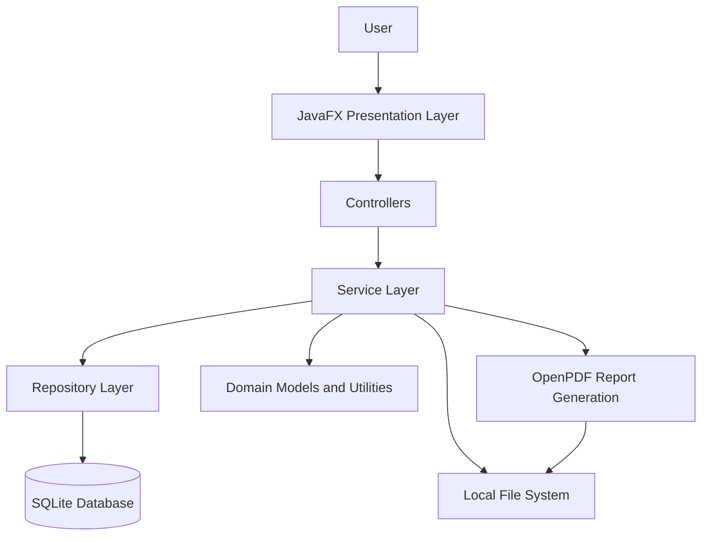

<div align="center">

# NETTECH Secure Password & File Integrity Checker

### A Local-First Desktop Cybersecurity Toolkit Built with Java 21 and JavaFX

**Generate stronger passwords. Analyze password patterns. Verify file integrity. Keep security activity local.**

[](https://www.oracle.com/java/)
[](https://openjfx.io/)
[](https://maven.apache.org/)
[](https://www.sqlite.org/)
[](https://junit.org/junit5/)

</div>

---

## Table of Contents

- [Project Overview](#project-overview)
- [Problem Statement](#problem-statement)
- [Project Objectives](#project-objectives)
- [Key Features](#key-features)
- [Application Modules](#application-modules)
- [Security Design and Privacy](#security-design-and-privacy)
- [System Architecture](#system-architecture)
- [Technology Stack](#technology-stack)
- [Requirements](#requirements)
- [Installation and Setup](#installation-and-setup)
- [Running the Application](#running-the-application)
- [Using NETTECH](#using-nettech)
- [Database and Local Storage](#database-and-local-storage)
- [Testing and Quality Assurance](#testing-and-quality-assurance)
- [Project Structure](#project-structure)
- [Known Limitations](#known-limitations)
- [Troubleshooting](#troubleshooting)
- [Future Enhancements](#future-enhancements)
- [Contributing](#contributing)
- [License](#license)

---

## Project Overview

**NETTECH Secure Password & File Integrity Checker** is a desktop cybersecurity utility designed to bring several practical security tasks together in one application. Built using **Java 21, JavaFX, SQLite, and Maven**, it provides password generation, password-strength analysis, cryptographic file hashing, file-integrity verification, PDF security reporting, security tips, and application settings.

NETTECH is designed as a **local-first application**. Its core security operations use local Java services and local storage rather than requiring a cloud account or external analysis API. This design is useful when working with files or passwords that should not be submitted to an online utility.

The application uses a layered architecture to separate the JavaFX presentation layer from security/business logic and database access. It also maintains selected activity metadata so users can review previous password-generation events, integrity checks, saved file baselines, and report exports.

### Project at a Glance

| Property | Details |
|---|---|
| Project name | NETTECH Secure Password & File Integrity Checker |
| Application type | Desktop GUI application |
| Primary language | Java 21 |
| User interface | JavaFX / OpenJFX |
| Build system | Apache Maven |
| Local database | SQLite |
| PDF generation | OpenPDF |
| Automated testing | JUnit 5 |
| Operating model | Local-first; no cloud service required for core workflows |
| Main purpose | Password hygiene and file-integrity verification |

## Problem Statement

Password and file-integrity tasks are often handled using separate tools. Some online tools also require users to submit sensitive text or file data to a third party. At the same time, simply calculating a file hash is not enough to monitor changes over time unless the hash is compared with a previously trusted reference.

NETTECH addresses these practical needs through a single desktop interface:

1. **Password hygiene:** Generate passwords with configurable length and character categories, and review password-strength feedback.
2. **File integrity:** Calculate file digests and compare a file against a saved baseline.
3. **Activity traceability:** Retain useful metadata about supported operations without storing plaintext passwords.
4. **Security awareness:** Present locally bundled guidance about safer password practices and file-hash limitations.
5. **Reporting:** Export selected security information as PDF reports for review or documentation.

NETTECH is a supporting security utility. It does not replace endpoint protection, secure credential storage, malware scanning, or a broader organizational security program.

## Project Objectives

The project aims to:

- Provide a straightforward desktop interface for common password and file-integrity tasks.
- Use Java's `SecureRandom` API for password generation.
- Analyze password length, character diversity, and common weak patterns.
- Calculate MD5 and SHA-256 file digests using standard Java cryptographic APIs.
- Use SHA-256 as the authoritative digest when verifying file integrity.
- Store file baselines and activity metadata in a local SQLite database.
- Generate PDF reports for password-security and file-integrity activity.
- Offer useful security guidance without requiring an online knowledge service.
- Keep UI code, business logic, and database access separated into maintainable layers.
- Provide automated tests for important services, repositories, and application behavior.

## Key Features

### 1. Password Security

The Password Security module combines password generation and password-strength analysis.

**Password generation**
- Configurable password length from 8 to 128 characters.
- Options for uppercase letters, lowercase letters, digits, and symbols.
- Uses `java.security.SecureRandom`.
- Ensures enabled character categories are represented when the selected length and configuration permit.
- Provides controls to show or hide the generated value and copy it when needed.

**Password-strength analysis**
- Produces a score and strength classification.
- Considers password length and character diversity.
- Checks for selected weak patterns, including repeated characters, sequential sequences, and common password-related words.
- Presents warnings and recommendations to help users improve a password.

**Privacy-conscious history**
- Stores metadata for supported password-generation history, such as timestamp, length, strength label, and score.
- The history model is designed not to store the plaintext generated password.
- Passwords entered for strength analysis should not be treated as saved credentials.

> **Important:** A strength score is a heuristic, not a guarantee that a password cannot be guessed or compromised. Avoid entering real, currently used passwords into any tool unless you have reviewed and trust its implementation and environment.

### 2. File Hashing and Integrity Verification

The File Integrity module calculates file digests and helps identify changes relative to a saved reference.

**Hash calculation**
- Calculates MD5 and SHA-256 digests using Java's `MessageDigest`.
- Processes files in chunks so the entire file does not need to be loaded into memory at once.
- Displays the resulting hash values for copying or review.

**Saved baselines**
- Saves selected file metadata and digest values as a baseline.
- Allows saved references to be reviewed and selected for later verification.
- Records reference details such as filename, path, file size, digest values, and timestamps.

**Verification results**
- `VERIFIED`: the file's SHA-256 digest matches the saved baseline.
- `MODIFIED`: the file's SHA-256 digest differs from the saved baseline.
- `UNABLE TO VERIFY`: the file is unavailable, unreadable, or cannot be verified against an appropriate reference.

SHA-256 is authoritative for integrity status. MD5 is retained for legacy compatibility and comparison, not as the deciding integrity check.

### 3. Security Reports and PDF Export

The Reports module generates PDF documents using OpenPDF.

Available report categories include:
- **Password Security Report** — summarizes supported password-security activity.
- **File Integrity Report** — summarizes file-integrity references and checks.
- **Combined Report** — brings together supported password and file-integrity information.

Depending on the selected report and available data, reports can include summary metrics, tables, timestamps, filenames, digest values, and verification outcomes. The application also tracks report-export metadata so previous exports can be reviewed.

Reports should be inspected before sharing because file paths, filenames, hashes, and timestamps may reveal information about a user's environment or activity.

### 4. Dashboard and Recent Activity

The Dashboard presents a summary of persisted activity, including:
- Password-generation activity.
- File baseline and integrity-check activity.
- Saved report count.
- A recent-activity list ordered by time.

The dashboard reads from the application's existing local repositories and can refresh when the user returns to the Dashboard. Its purpose is to provide a convenient overview, not to act as a real-time security monitoring or intrusion-detection system.

### 5. Security Tips

The Security Tips module provides locally bundled cybersecurity guidance. It supports keyword search and category filtering, allowing users to find relevant guidance without depending on an external content service.

Topics include practical security habits and explanations of the scope and limitations of hashing and password-strength checks.

### 6. Settings and Customization

The Settings module includes supported options such as:
- Dark and light themes.
- Persistent theme preference.
- Configurable report output directory.
- Options to clear supported history records.
- Inspection of local storage locations.
- Application information.

Take care when clearing history or deleting files. Exported PDF files and saved file baselines are separate from some history records; review the confirmation dialog and the resulting state before proceeding.

---

## Security Design and Privacy

NETTECH follows several security-oriented implementation principles.

| Principle | Implementation intent |
|---|---|
| Cryptographically strong generation | Use `java.security.SecureRandom` for generated passwords. |
| Standard digest APIs | Use Java's `MessageDigest` for file hashes. |
| SHA-256 verification | Use SHA-256 as the authoritative comparison against a saved baseline. |
| Chunked file processing | Read files incrementally to limit memory usage. |
| Password-history minimization | Store password-generation metadata rather than the generated plaintext. |
| Local persistence | Store application records in a local SQLite database. |
| Separation of concerns | Keep presentation, service logic, and persistence responsibilities separated. |
| Local security guidance | Bundle tips with the application rather than requiring a remote API. |

### What “local-first” means

The core workflows are designed to run on the user's machine:
- Password generation and analysis run through local application code.
- File hashing reads the selected file locally.
- Database records are stored in the configured local SQLite database.
- PDF reports are generated and saved to a local destination selected by the user.

This describes the application's intended architecture; it is not a substitute for independently monitoring network traffic or auditing every dependency. Keep the application and its dependencies updated, protect access to the computer, and avoid sharing reports that contain sensitive metadata.

### Important cryptographic distinctions

- **A hash is not encryption.** It is a digest used to compare data.
- **A matching hash is not a malware verdict.** It indicates that the file matches the selected reference under the digest comparison.
- **A trusted baseline matters.** If both a file and its baseline can be altered by an attacker, local verification may not reveal the change.
- **SHA-256 is preferred over MD5** for integrity verification. MD5 has known collision weaknesses and should not be used where collision resistance is required.
- **Password strength estimates are approximate.** They do not account for every attack method, leaked-password corpus, or real-world context.

## System Architecture

NETTECH uses a layered design to make the code easier to understand, test, and maintain.



### Architecture layers

**Presentation layer**
- JavaFX application shell and screen controllers.
- Handles user interactions, input validation feedback, tables, navigation, and display state.
- Calls application services rather than embedding SQL in UI event handlers.

**Service layer**
- Contains password-generation and strength-analysis workflows.
- Calculates file digests and performs integrity comparisons.
- Coordinates report generation and dashboard aggregation.
- Applies application rules before or during persistence.

**Repository layer**
- Encapsulates SQLite queries and record persistence.
- Supports password-history metadata, integrity references, integrity history, and reports.

**Domain model and utility layer**
- Represents application records and operation results.
- Provides shared constants and file/security utilities.

**Local persistence and files**
- SQLite stores supported application records.
- The file system holds selected source files, settings, and exported reports.

## Technology Stack

| Technology | Role |
|---|---|
| Java 21 | Application language and runtime |
| JavaFX / OpenJFX | Desktop UI controls and application interface |
| CSS | JavaFX visual styling and themes |
| Apache Maven | Build, dependency management, and test execution |
| SQLite | Local relational persistence |
| SQLite JDBC | Java-to-SQLite connectivity |
| OpenPDF | PDF report generation |
| JUnit 5 | Automated testing |

For exact dependency versions, consult `pom.xml`, which is the source of truth for the current checkout.

---

## Requirements

Before installing NETTECH, ensure your system has:

1. **JDK 21** — a full JDK, not only a JRE.
2. **Apache Maven 3.9 or later** — required for the documented Maven workflow.
3. **A supported desktop environment** capable of running JavaFX.
4. **Sufficient disk space and permissions** to store the local database, settings, and exported reports.

Verify Java and Maven from a terminal:

```bash
java -version
javac -version
mvn -version
```

The Java commands should report JDK 21. Maven should run using that JDK. If `java` and Maven use different Java installations, correct `JAVA_HOME` and your system `PATH` before proceeding.

## Installation and Setup

### Option A: Run from source (recommended)

This is the recommended setup for developers, reviewers, and students who want to run the project from its source code.

#### Step 1 — Obtain the project

Clone the repository if it is hosted on GitHub:

```bash
git clone <REPOSITORY_URL>
cd Nettech-Secure-Checker
```

Replace `<REPOSITORY_URL>` with the actual repository URL.

Alternatively, download the repository as a ZIP from your Git hosting service, extract it, and open a terminal in the extracted project directory.

#### Step 2 — Install JDK 21

Install a JDK 21 distribution suitable for your operating system. After installation, configure `JAVA_HOME` to point to the JDK installation directory and ensure the JDK's `bin` directory is on `PATH`.

Examples of the kind of values expected:

- `JAVA_HOME`: the JDK 21 installation directory.
- `PATH`: includes `%JAVA_HOME%\bin` on Windows or `$JAVA_HOME/bin` on macOS/Linux.

Open a new terminal and verify:

```bash
java -version
javac -version
```

If the version is not 21, resolve the Java configuration before building.

#### Step 3 — Install Apache Maven

Install Maven 3.9 or later and add its `bin` directory to `PATH`, or use the full path to `mvn`/`mvn.cmd`.

Verify:

```bash
mvn -version
```

The output should show Maven and the Java version Maven is using.

#### Step 4 — Open the project root

The project root is the directory containing `pom.xml`. Run all commands below from that directory.

Check that the file is present:

```bash
```

You should see `pom.xml`, `src/`, and `README.md` in the project directory.

#### Step 5 — Download dependencies and compile

Run:

```bash
mvn clean compile
```

Maven resolves dependencies declared in `pom.xml`, compiles the application, and reports any compilation errors. The first build may take longer while dependencies are downloaded.

#### Step 6 — Run the automated tests

Run:

```bash
mvn clean test
```

Review the Maven output and confirm the build succeeds and the tests have no failures. Do not rely only on the test count documented in this README; the result from the checkout you are running is authoritative.

#### Step 7 — Launch NETTECH

Run:

```bash
mvn javafx:run
```

The NETTECH desktop window should open. Use the application navigation to access Dashboard, Password Security, File Integrity, Reports, Security Tips, and Settings.

### Option B: Windows PowerShell setup

If Maven is installed but not available on `PATH`, use its full path. For example, if Maven is installed at `C:\tools\apache-maven-3.9.9`:

```powershell
& "C:\tools\apache-maven-3.9.9\bin\mvn.cmd" -version
& "C:\tools\apache-maven-3.9.9\bin\mvn.cmd" clean compile
& "C:\tools\apache-maven-3.9.9\bin\mvn.cmd" clean test
& "C:\tools\apache-maven-3.9.9\bin\mvn.cmd" javafx:run
```

If your Maven installation is in another folder, replace the path accordingly. These commands are examples; they are not a requirement to install Maven in that exact location.

### Option C: Build a JAR

To create the Maven package, run:

```bash
mvn clean package
```

The generated artifact is normally placed under `target/`. Check the actual filename in that directory.

**Packaging note:** A successful Maven package does not necessarily mean the artifact is a self-contained Windows executable. JavaFX runtime modules and other dependencies may be required. The source-run command `mvn javafx:run` is the documented launch method unless a separate runtime bundle or installer has been prepared and tested.

---

## Running the Application

From the project root:

```bash
mvn javafx:run
```

On first launch, the application may initialize its local database and create the required tables. The exact data and settings locations depend on the configured paths and the working directory from which the application is launched.

For consistent behavior, launch the app from the project root when using the Maven command.

## Using NETTECH

### Workflow 1 — Generate a password

1. Open **Password Security**.
2. Select the desired password length.
3. Enable the required character categories.
4. Generate the password.
5. Review it and use the show/hide or copy controls as appropriate.
6. Review the recorded metadata in the history section if needed.

Do not paste generated passwords into screenshots, issue reports, or public documentation.

### Workflow 2 — Analyze password strength

1. Open the password-strength analyzer.
2. Enter a test password.
3. Review the score, strength label, detected patterns, and recommendations.
4. Try a longer password or remove predictable patterns and compare the feedback.

For demonstrations, use sample passwords rather than credentials used for real accounts.

### Workflow 3 — Calculate a file hash

1. Open **File Integrity**.
2. Choose the file to inspect.
3. Run the hash calculation.
4. Review the MD5 and SHA-256 results.
5. Copy the digest if you need to compare it with a trusted value.

### Workflow 4 — Register and verify a baseline

1. Select a file and calculate its hashes.
2. Save the file as a baseline reference.
3. Open the verification workflow and select the saved reference.
4. Verify the unchanged file; it should return `VERIFIED` when the SHA-256 digest matches.
5. For a controlled test, modify a disposable test file and verify it again. A different SHA-256 digest should return `MODIFIED`.
6. If the file is missing or cannot be read, the application may report `UNABLE TO VERIFY`.

Use disposable test files for demonstrations. Do not modify important documents merely to test integrity checking.

### Workflow 5 — Generate a PDF report

1. Open **Reports**.
2. Select the report type.
3. Choose the destination if prompted.
4. Generate the report.
5. Open the PDF and review its contents.
6. Check the report history in the application.

Before sharing a report, check whether it contains local paths, filenames, timestamps, or hashes you do not want to disclose.

### Workflow 6 — Customize settings

1. Open **Settings**.
2. Select the preferred theme.
3. Set the report output directory if required.
4. Review local storage paths.
5. Use history-clearing controls carefully and confirm the result.

---

## Database and Local Storage

NETTECH uses SQLite for supported local application records. The default database path in the current configuration is `data/nettech.db`, relative to the application's working directory.

### Main tables

| Table | Purpose |
|---|---|
| `password_history` | Metadata for password-generation events, such as time, length, strength, and score. |
| `integrity_references` | Saved file baseline metadata and digest values. |
| `integrity_history` | Results and timestamps for file-integrity checks. |
| `reports` | Metadata for generated reports, such as report type, time, filename, and output path. |

The exact schema is defined in `src/main/resources/database/schema.sql` and may evolve with future changes.

### Protecting local data

- Do not commit `data/nettech.db` if it contains your personal activity.
- Do not commit generated reports unless they are sanitized sample artifacts intended for publication.
- Review `.gitignore` before pushing the repository.
- Back up the database if you need to preserve your local history.
- Remember that deleting a history record is different from deleting an exported PDF or a saved baseline.

## Testing and Quality Assurance

Run the full automated test suite from the project root:

```bash
mvn clean test
```

To create a packaged build after testing:

```bash
mvn package
```

The latest QA report in the development workflow recorded **90 tests passing, with 0 failures, 0 errors, and 0 skipped**, and a successful Maven package. Because the project can change after that report, rerun the commands above to confirm the current checkout's status.

Test coverage includes areas such as:
- Database initialization and persistence.
- Password generation and strength analysis.
- File hashing and integrity verification.
- Report generation.
- Settings and security tips.
- File utilities and input validation.
- Security-related invariants.
- Dashboard metrics and activity ordering.

Automated tests cannot confirm every visual interaction. Before presenting or distributing the application, manually verify the JavaFX screens, PDF output, settings persistence, file-verification workflows, and launch behavior on the intended machine.

## Project Structure

The following is a high-level guide to the source tree. Exact filenames may vary as the project evolves.

```text
Nettech-Secure-Checker/
├── pom.xml
├── README.md
├── .gitignore
├── src/
│   ├── main/
│   │   ├── java/com/nettech/securechecker/
│   │   │   ├── Main.java
│   │   │   ├── app/
│   │   │   │   └── NettechApplication.java
│   │   │   ├── controller/
│   │   │   │   ├── DashboardController.java
│   │   │   │   ├── PasswordController.java
│   │   │   │   ├── IntegrityController.java
│   │   │   │   ├── ReportsController.java
│   │   │   │   ├── TipsController.java
│   │   │   │   └── SettingsController.java
│   │   │   ├── model/
│   │   │   │   └── Domain and result models
│   │   │   ├── repository/
│   │   │   │   └── SQLite repositories
│   │   │   ├── service/
│   │   │   │   ├── PasswordService.java
│   │   │   │   ├── PasswordStrengthService.java
│   │   │   │   ├── HashService.java
│   │   │   │   ├── IntegrityService.java
│   │   │   │   ├── ReportService.java
│   │   │   │   └── DashboardService.java
│   │   │   ├── util/
│   │   │   └── config/
│   │   └── resources/
│   │       ├── css/
│   │       └── database/schema.sql
│   └── test/java/com/nettech/securechecker/
│       ├── DashboardTest.java
│       ├── DatabaseManagerTest.java
│       ├── HashServiceTest.java
│       ├── IntegrityServiceTest.java
│       ├── PasswordGeneratorTest.java
│       ├── PasswordStrengthServiceTest.java
│       ├── ReportServiceTest.java
│       ├── SecurityAuditTest.java
│       ├── SettingsAndTipsTest.java
│       └── UtilityTest.java
├── data/       # Local runtime database; do not commit personal data
└── reports/    # Local report output; contents may be sensitive
```

## Known Limitations

- Password-strength analysis uses local rules and heuristics; it is not a breach-database lookup.
- File-integrity verification depends on a previously saved, trustworthy baseline.
- The application is not a malware scanner, antivirus product, or intrusion-detection system.
- A locally stored database may be altered by someone with sufficient access to the machine.
- A regular Maven JAR may not include everything needed for a standalone desktop installation.
- The application has not been described here as independently penetration-tested or externally security-certified.

## Troubleshooting

### `mvn` is not recognized

Maven is either not installed or its `bin` directory is not on `PATH`. Install Maven or run `mvn.cmd` using its full Windows path.

### Java version is incorrect

Run `java -version` and `mvn -version`. Ensure both use JDK 21, then reopen the terminal after changing `JAVA_HOME` or `PATH`.

### The JavaFX application does not launch

- Run the command from the directory containing `pom.xml`.
- Try `mvn clean javafx:run`.
- Review the complete terminal output for JavaFX module or dependency errors.
- Confirm that the project's JavaFX Maven configuration in `pom.xml` is intact.

### The dashboard displays empty activity

- Confirm you are opening the same application data directory used when the activities were recorded.
- Return to the Dashboard or use its Refresh control if available.
- Check that the corresponding operation completed and was recorded.
- Do not delete or reset the database as a troubleshooting shortcut.

### A file is reported as modified

The file's SHA-256 digest differs from the saved baseline. Confirm that you selected the intended reference and that the file has not legitimately changed since the baseline was registered.

### A PDF report cannot be saved

Check that the destination directory exists, that you have write permission, and that the PDF is not locked by another application.

## Future Enhancements

Potential future improvements include:
- Packaging a tested, self-contained Windows distribution or installer.
- Adding automated UI smoke tests.
- Providing clearer export and backup workflows.
- Improving accessibility and keyboard navigation.
- Adding more configurable report templates.
- Expanding test coverage for filesystem and database failure scenarios.

These are potential enhancements, not claims that the features already exist.

## Contributing

Contributions and suggestions are welcome.

1. Fork the repository.
2. Create a feature branch.
3. Keep UI, service, and persistence responsibilities separated.
4. Add or update tests for behavior changes.
5. Run `mvn clean test`.
6. Submit a pull request describing the change and its verification.

Never include real passwords, personal database files, or sensitive report exports in issues, commits, or pull requests.

## License

No license is specified in this README. Before redistributing the project, choose a license and add the corresponding `LICENSE` file. Until then, do not assume that others have permission to reuse or redistribute the source.

---

<div align="center">

**NETTECH Secure Password & File Integrity Checker**

*Built with Java 21 · JavaFX · SQLite · OpenPDF*

</div>
